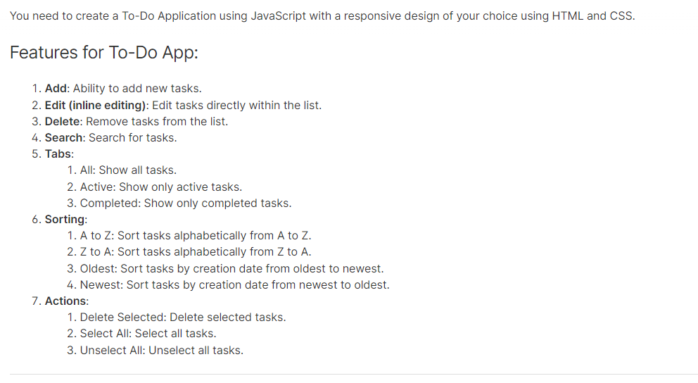

# To-Do Application

## Overview

This To-Do Application is built using JavaScript with a responsive design created with HTML and CSS. It allows users to manage their tasks efficiently with various features like adding, editing, deleting, searching, and sorting tasks. The app also provides options to filter tasks based on their status and perform bulk actions.

## Features



1. **Add**: Ability to add new tasks.
2. **Edit (inline editing)**: Edit tasks directly within the list.
3. **Delete**: Remove tasks from the list.
4. **Search**: Search for tasks.
5. **Tabs**:
   - **All**: Show all tasks.
   - **Active**: Show only active tasks.
   - **Completed**: Show only completed tasks.
6. **Sorting**:
   - **A to Z**: Sort tasks alphabetically from A to Z.
   - **Z to A**: Sort tasks alphabetically from Z to A.
   - **Oldest**: Sort tasks by creation date from oldest to newest.
   - **Newest**: Sort tasks by creation date from newest to oldest.
7. **Actions**:
   - **Delete Selected**: Delete selected tasks.
   - **Select All**: Select all tasks.
   - **Unselect All**: Unselect all tasks.

## Installation

To run this application locally, follow these steps:

1. Clone the repository:

    ```bash
    git clone https://github.com/yourusername/todo-app.git
    ```

2. Navigate to the project directory:

    ```bash
    cd todo-app
    ```

3. Open `index.html` in your web browser to start using the app.

## Usage

- **Adding Tasks**: Use the input field at the top of the page to enter a new task and click the "Add" button.
- **Editing Tasks**: Click on a task to enable inline editing. Make your changes and hit enter to save.
- **Deleting Tasks**: Click the delete icon next to a task to remove it from the list.
- **Searching Tasks**: Use the search bar to filter tasks by their names.
- **Filtering Tasks**: Use the tabs to switch between all tasks, active tasks, and completed tasks.
- **Sorting Tasks**: Use the sorting options to arrange tasks alphabetically or by their creation date.
- **Bulk Actions**: Use the action buttons to select all, unselect all, or delete selected tasks.

## Contributing

Contributions are welcome! Please fork the repository and create a pull request with your changes.

## License

This project is licensed under the MIT License.
